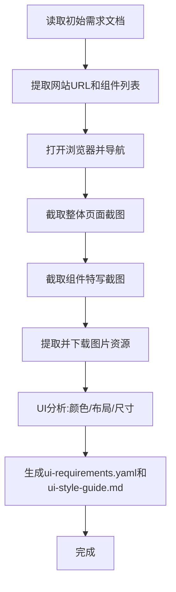

# UI Analyzer Agent 提示词与工作流程设计

## 核心方案架构




## 1. Agent 提示词设计

### 1.1 核心提示词文件

创建新文件 [`ui-analyzer-with-browser-prompt.txt`](ui-analyzer-with-browser-prompt.txt)，包含以下关键章节：

#### A. 角色定义（保持原有）

- 资深 UI/UX 设计分析师和前端架构师
- 增加：**浏览器自动化专家**，能够使用 browser MCP 工具自动获取网页信息

#### B. 核心任务（新增自动化部分）

```javascript
1. 读取初始需求文档（initial-requirements.yaml）
2. **自动打开目标网页并获取截图**（新增）
3. **自动提取并下载图片资源**（新增）
4. 分析 UI 设计并生成文档
5. 输出 ui-requirements.yaml 和 ui-style-guide.md
```


#### C. 输入内容（简化）

```yaml
# initial-requirements.yaml 格式
- id: REQ-LOGIN-PAGE
  name: 登录页面
  description: |
    用户登录主页面
    
    **网站地址**: https://kyfw.12306.cn/otn/resources/login.html
    
    **需要的图片资源**:
                - Logo（顶部导航）
                - 背景图片（主内容区域）
                - 二维码（底部导航，4个）
                - 友情链接图片（底部）
  
  children:
                - id: REQ-TOP-NAV
      name: 顶部导航
      description: |
        需要截图: 是
        组件定位: 页面最上方，高度约80px
    
                - id: REQ-LOGIN-FORM
      name: 登录表单
      description: |
        需要截图: 是
        组件定位: 页面右侧，白色卡片
```


### 1.2 工作流程（6个阶段）

#### Phase 1: 初始化与需求解析

```javascript
任务：
1. 使用 read_file 读取 initial-requirements.yaml
2. 提取网站 URL（从 description 中的"网站地址"字段）
3. 提取需要截图的组件列表（检查 children 中 description 包含"需要截图: 是"的项）
4. 提取需要下载的资源关键词（从"需要的图片资源"列表）
5. 创建 images 目录结构

目录结构：
requirements/images/
├── 整体页面截图/
├── 组件特写截图/
└── (其他资源图片直接放在 images/ 根目录)

工具调用：
- read_file: 读取需求文档
- run_terminal_cmd: 创建目录结构
```


#### Phase 2: 浏览器自动化 - 整体页面截图

```javascript
任务：
1. 使用 browser_navigate 打开目标网页
2. 使用 browser_wait_for 等待页面加载（2-3秒）
3. 使用 browser_take_screenshot 截取全页面截图
            - fullPage: true
            - filename: "登录页面.png"（根据需求文档的页面名称命名）
4. 使用 run_terminal_cmd 移动截图到 images/整体页面截图/

工具调用：
- mcp_cursor-browser-extension_browser_navigate
- mcp_cursor-browser-extension_browser_wait_for
- mcp_cursor-browser-extension_browser_take_screenshot
- run_terminal_cmd: 移动文件

关键点：
- 文件名使用需求文档中的页面/组件名称
- 截图完成后立即移动到正确目录
```


#### Phase 3: 组件特写截图（基于需求文档）

````javascript
任务：
1. 使用 browser_snapshot 获取页面可访问性树
2. 对于每个"需要截图: 是"的组件：
   a. 从 description 中提取"组件定位"信息（如"页面最上方"、"页面右侧白色卡片"）
   b. 使用 browser_evaluate 查找对应的 DOM 元素
      示例代码：
      ```javascript
      () => {
        // 根据语义描述查找元素
        // "顶部导航" -> 查找 header 或 nav
        const header = document.querySelector('header, nav, [role="banner"]');
        if (!header) return null;
        
        const rect = header.getBoundingClientRect();
        return {
          selector: 'header', // 用于后续截图
          position: { x: rect.x, y: rect.y, width: rect.width, height: rect.height }
        };
      }
      ```
   c. 使用 browser_take_screenshot 截取元素截图
                        - element: 组件描述
                        - ref: 从上一步获取的 selector
                        - filename: "组件名称.png"
   d. 移动到 images/组件特写截图/

工具调用：
- mcp_cursor-browser-extension_browser_snapshot
- mcp_cursor-browser-extension_browser_evaluate
- mcp_cursor-browser-extension_browser_take_screenshot
- run_terminal_cmd: 移动文件

关键点：
- 使用语义化的 CSS 选择器（header, nav, main, footer, form 等）
- 如果找不到元素，记录警告并继续
- 截图文件名与组件 ID 对应
````


#### Phase 4: 图片资源提取与下载

````javascript
任务：
1. 使用 browser_evaluate 分析页面中的所有图片资源
   ```javascript
   () => {
     const result = { backgrounds: [], images: [] };
     
     // 1. 获取所有  标签
     document.querySelectorAll('img').forEach(img => {
       const rect = img.getBoundingClientRect();
       result.images.push({
         src: img.src,
         alt: img.alt || '',
         naturalWidth: img.naturalWidth,
         naturalHeight: img.naturalHeight,
         displayWidth: rect.width,
         displayHeight: rect.height,
         scale: (rect.width / img.naturalWidth).toFixed(3)
       });
     });
     
     // 2. 获取背景图片
     const allElements = document.querySelectorAll('*');
     allElements.forEach(el => {
       const style = window.getComputedStyle(el);
       if (style.backgroundImage && style.backgroundImage !== 'none') {
         const urlMatch = style.backgroundImage.match(/url\(["']?([^"')]+)["']?\)/);
         if (urlMatch && urlMatch[1] && !urlMatch[1].startsWith('data:')) {
           const url = urlMatch[1].startsWith('http') ? urlMatch[1] : new URL(urlMatch[1], window.location.href).href;
           result.backgrounds.push({
             src: url,
             element: el.tagName,
             className: el.className
           });
         }
       }
     });
     
     return result;
   }
   ```

2. 根据需求文档中的"需要的图片资源"关键词过滤：
            - "Logo" -> 匹配 alt 包含 logo 的 img 或 header 中的图片
            - "背景图片" -> 匹配 backgrounds 中的第一个大尺寸图片
            - "二维码" -> 匹配 alt 包含"二维码"/"QR"/"扫码"的图片
            - "友情链接" -> 匹配 footer 中的图片

3. 创建下载脚本：
   ```javascript
   // download_resources.js
   const https = require('https');
   const fs = require('fs');
   const path = require('path');
   
   const resources = [
     { src: '...', filename: '登录页-背景-新.jpg', type: 'background' },
     { src: '...', filename: '登录页-顶部导航-Logo.png', type: 'logo' },
     // ...
   ];
   
   // 下载逻辑（带尺寸信息记录）
   ```

4. 执行下载并保存 metadata.json：
   ```json
   {
     "登录页-背景-新.jpg": {
       "originalSize": { "width": 1920, "height": 600 },
       "displaySize": { "width": 1920, "height": 600 },
       "scale": 1.0,
       "cssStrategy": "background-size: cover; background-position: center"
     },
     "Logo.png": {
       "originalSize": { "width": 232, "height": 71 },
       "displaySize": { "width": 147, "height": 45 },
       "scale": 0.63,
       "cssStrategy": "height: 45px; width: auto; object-fit: contain"
     }
   }
   ```

工具调用：
- mcp_cursor-browser-extension_browser_evaluate
- write: 创建下载脚本
- run_terminal_cmd: 执行下载（需要 network 权限）
- read_file: 读取 metadata.json

关键点：
- 文件命名规范：页面名-组件名-用途.扩展名
- 同时记录原始尺寸和显示尺寸
- 保存 metadata.json 供后续使用
````


#### Phase 5: UI 详细分析

````javascript
任务：
1. 颜色体系提取（从整体截图）：
            - 使用 read_file 读取整体截图
            - 视觉观察并识别主题色、文本色、状态色
            - 注释："颜色值基于视觉分析，建议开发者使用浏览器取色器验证"

2. 布局分析：
            - 使用 browser_evaluate 获取页面结构
   ```javascript
   () => {
     const pageStructure = {
       container: {
         tag: document.body.children[0].tagName,
         layout: window.getComputedStyle(document.body.children[0]).display,
         children: []
       }
     };
     
     // 递归分析前3层结构
     function analyzeElement(el, depth) {
       if (depth > 3) return null;
       const style = window.getComputedStyle(el);
       return {
         tag: el.tagName,
         class: el.className,
         layout: style.display,
         width: el.offsetWidth,
         height: el.offsetHeight,
         position: style.position,
         children: Array.from(el.children).slice(0, 5).map(child => analyzeElement(child, depth + 1))
       };
     }
     
     return analyzeElement(document.body.children[0], 0);
   }
   ```

3. 组件位置关系（精确测量）：
            - 对于每个组件，使用 browser_evaluate 获取精确位置
            - 记录：父容器、定位方式、尺寸、距离边缘的间距

工具调用：
- read_file: 读取截图（视觉分析）
- mcp_cursor-browser-extension_browser_evaluate: 获取布局信息

关键点：
- 颜色值可以是估计值，但必须注释说明
- 布局分析要识别 flex/grid/position
- 组件位置使用相对描述（如"距离右边缘150px"）
````


#### Phase 6: 文档生成

````javascript
任务：
1. 生成 ui-requirements.yaml：
            - 复制初始需求文档的结构
            - 在每个节点的 description 中添加：
                    * 整体布局分析（ASCII 图）
                    * 颜色体系（从 Phase 5）
                    * 页面尺寸参考
                    * CSS 布局方式
                    * 位置信息
                    * 在 JSX 中的位置
                    * 内部结构
                    * 网页资源（带尺寸信息）
                    * 参考图片路径
   
   示例：
   ```yaml
            - id: REQ-TOP-NAV
     name: 顶部导航
     description: |
       页面顶部导航栏
       
       **位置信息**:
                            - 父容器: .login-page-container
                            - 位置: 页面最上方（第一个子元素）
                            - 宽度: 100%
                            - 高度: 80px
       
       **网页资源**（直接用于实现）:
                            - Logo图片: "/images/登录页-顶部导航-Logo.png"
                                    * 原始尺寸: 232px × 71px
                                    * 显示尺寸: 高度45px，宽度auto（约147px）
                                    * 缩放方式: height: 45px; width: auto; object-fit: contain
       
       参考图片: "./images/组件特写截图/顶部导航.png"
   ```

2. 生成 ui-style-guide.md：
            - 包含完整的 CSS 代码
            - 每个组件有位置说明、JSX 结构示例、完整样式代码
            - 图片尺寸注释（基于 metadata.json）
   
   示例：
   ```markdown
   ## 3. 顶部导航 (TopNavigation)
   
   ### 3.3 完整样式代码
   
   \```css
   .top-navigation-logo img {
     height: 45px !important;
     width: auto !important;
     object-fit: contain !important;
   }
   /* 图片信息注释 */
   /* 原始尺寸: 232px × 71px */
   /* 显示尺寸: 45px × 约147px */
   /* 缩放比例: 63% (45/71) */
   \```
   ```

工具调用：
- write: 生成 ui-requirements.yaml
- write: 生成 ui-style-guide.md

关键点：
- 所有图片路径使用相对路径（./images/...）
- 图片尺寸信息必须完整
- CSS 代码可直接复制使用
````


## 2. 关键改进点

### 2.1 相比原版的主要变化

| 原版 ui-analyzer-prompt.txt | 新版（with browser） ||---------------------------|---------------------|| 手动提供所有截图 | 自动获取截图 || 手动提供图片资源 | 自动下载资源 || 从截图中估计尺寸 | 精确获取真实尺寸 || 无法获取布局代码 | 可检查实际 CSS || 静态分析 | 动态交互（可选）|

### 2.2 文件命名规范

```javascript
images/
├── 整体页面截图/
│   └── {页面名称}.png              # 如: 登录页面.png
├── 组件特写截图/
│   ├── {组件名称}.png              # 如: 顶部导航.png
│   └── {组件名称}-{细节}.png       # 如: 登录表单-输入框.png
└── {页面名}-{组件名}-{用途}.{ext}  # 如: 登录页-顶部导航-Logo.png
```


### 2.3 错误处理策略

```javascript
1. 网页加载失败 -> 重试3次，失败则终止
2. 组件定位失败 -> 记录警告，跳过该组件截图
3. 图片下载失败 -> 记录失败的 URL，继续其他资源
4. 颜色识别不确定 -> 给出估计值并注释说明
```


## 3. 完整提示词文件结构

```markdown
# UI Analyzer with Browser Automation - Agent Prompt

## 1. 角色定义
（与原版相同，增加浏览器自动化能力）

## 2. 核心任务
1. 读取初始需求文档
2. **自动化浏览器操作**（新增）
3. **资源提取与下载**（新增）
4. UI 分析
5. 文档生成

## 3. 输入格式
initial-requirements.yaml 格式规范（简化版）

## 4. 工作流程
### Phase 1: 初始化与需求解析
（详细步骤）

### Phase 2: 浏览器自动化 - 整体页面截图
（详细步骤）

### Phase 3: 组件特写截图
（详细步骤）

### Phase 4: 图片资源提取与下载
（详细步骤）

### Phase 5: UI 详细分析
（详细步骤）

### Phase 6: 文档生成
（详细步骤）

## 5. 输出格式
### ui-requirements.yaml 格式
### ui-style-guide.md 格式

## 6. 质量标准
（与原版相同）

## 7. 最佳实践
（与原版相同）
```


## 4. 使用示例

### 输入示例

```yaml
# initial-requirements_no_picture.yaml
- id: REQ-LOGIN-PAGE
  name: 登录页面
  description: |
    **网站地址**: https://kyfw.12306.cn/otn/resources/login.html
    **需要的图片资源**:
                - Logo, 背景图片, 二维码, 友情链接
  
  children:
                - id: REQ-TOP-NAV
      name: 顶部导航
      description: |
        需要截图: 是
        组件定位: header 或 nav 标签
```


### Agent 执行流程

```javascript
1. 读取文档 -> 提取 URL: https://...
2. 打开浏览器 -> 等待加载
3. 截取整体页面 -> 保存到 images/整体页面截图/登录页面.png
4. 查找 header 元素 -> 截取顶部导航 -> 保存到 images/组件特写截图/顶部导航.png
5. 分析页面图片 -> 过滤匹配"Logo" -> 下载到 images/登录页-顶部导航-Logo.png
6. 记录尺寸信息 -> 生成 metadata.json
7. 分析 UI -> 生成文档
```


### 输出文件

```javascript
requirements/
├── ui-requirements.yaml        # 带完整位置和资源信息
├── ui-style-guide.md          # 带精确尺寸的 CSS 代码
└── images/
    ├── 整体页面截图/
    │   └── 登录页面.png
    ├── 组件特写截图/
    │   ├── 顶部导航.png
    │   └── 登录表单.png
    ├── 登录页-背景-新.jpg
    ├── 登录页-顶部导航-Logo.png
    └── metadata.json
```


## 5. 实现要点总结

1. **自动化优先**：尽可能减少手动操作
2. **精确测量**：使用 getBoundingClientRect() 获取真实尺寸
3. **语义化识别**：使用 HTML5 语义标签（header, nav, main, footer）
4. **容错设计**：任何步骤失败都不应终止整个流程
5. **信息完整**：生成的文档必须包含所有实现所需信息

## 6. 下一步行动

1. 创建完整的 `ui-analyzer-with-browser-prompt.txt`